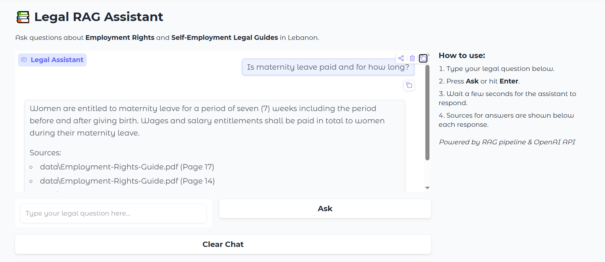

# 📚 Legal RAG Assistant

A Legal Question-Answering assistant for Employment Rights and Self-Employment Legal Guides in Lebanon.
It uses a Retrieval-Augmented Generation (RAG) pipeline with a vectorstore to provide precise answers strictly based on legal guides.


## Features:

- Answer legal questions using local guides (Employment-Rights-Guide.pdf and Self-Employment-Guide.pdf).

- Returns the answer and the exact sources (document and page numbers).

- Clean, interactive chat interface built with Gradio.

- Uses OpenAI GPT for precise responses with RAG-based context retrieval.

- Error-handled: No crashes even if questions are invalid or retrieval fails.


## Folder Structure:

├─ development_notebook.ipynb
├─ rag_pipeline.py          # Core RAG pipeline
├─ test_pipeline.py         # Example/testing scripts for RAG pipeline
├─ gradio_app.py            # Gradio chat interface
├─ api.py                   # FastAPI endpoint serving the RAG pipeline
├─ data/                    # Folder containing legal guide PDFs
├─ assets/                  # Folder containing the demo screenshot
├─ chunks.pkl               # Serialized text chunks for retrieval
├─ index.faiss              # FAISS vector index
├─ requirements.txt 
└─ README.md


## Setup and Installation:

1. Clone the repository:
```bash
git clone https://github.com/Batouls1/Labour_Rights_RAG_Assistant
cd Labour_Rights_RAG_Assistant
```

2. Create a virtual environment and activate it:
```bash
# Windows
python -m venv venv
venv\Scripts\activate.bat

# Mac/Linux
python -m venv venv
source venv/bin/activate
```

3. Install dependencies:
```bash
pip install -r requirements.txt
```

4. Create a .env file in the project root with your OpenAI API key:

OPENAI_API_KEY=your_openai_api_key_here


## Running the Project:

**Step 1 - Start the FastAPI server**
```bash
uvicorn api:app --reload
```
- The server runs at: http://127.0.0.1:8000/ask
- This endpoint handles legal questions and returns JSON responses.

**Step 2 — Start the Gradio interface**

In a new terminal (same virtual environment):
```bash
python gradio_app.py
```
- Open your browser at http://127.0.0.1:7860
- Ask legal questions and get answers with sources displayed in the chat.
*Tip:* The chat keeps history of previous questions; use Clear Chat to reset.


## Testing the RAG Pipeline:

You can test retrieval and answer generation directly:
```bash
python test_pipeline.py
```
- Includes example queries and computes retrieval accuracy (Hit@3).
- Useful for debugging or verifying the RAG pipeline.


## Project Workflow:

1. RAG Pipeline (rag_pipeline.py):

- Loads FAISS index and text chunks.
- Embeds the query using SentenceTransformer.
- Retrieves top-k relevant chunks.
- Generates an answer using OpenAI GPT, strictly based on retrieved context.

2. API Endpoint (api.py):

- Wraps the pipeline with FastAPI.
- Returns answers and sources in JSON.
- Handles errors properly.

3. Gradio Chat (gradio_app.py):

- Provides a user-friendly interface.
- Sends questions to the FastAPI endpoint.
- Displays answers and sources in chat format.


### Notes:

- **Local usage only:** For now, the app runs locally. A sharable public URL can be generated using Gradio's share=True, or you can deploy on a cloud server for permanent hosting.

- **Number of questions:** Chat history is stored in memory; no hard limit, but very long sessions may slightly affect performance.

- **Data privacy:** The app uses your OpenAI API key locally. No external storage of questions or answers.


## Dependencies:

- **gradio** - chat interface
- **fastapi + uvicorn** - API server
- **openai** - GPT completions
- **faiss** - vector search
- **sentence-transformers** - embeddings
- **python-dotenv** - load .env keys
- **numpy, pickle** - data handling


## Demo

Here's how the Legal RAG Assistant looks when running locally:



*Example question:* "Is maternity leave paid and for how long?"
